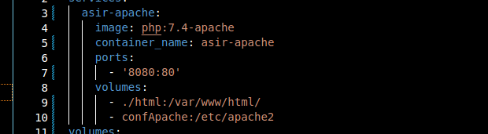

# proyectoApache

 **Para la realización de este ejercicio empezaremos por:**

## Buscar una imagen ya hecha de apache en php ##

   - Buscamos la imagen de php, para la que elegimos php 7.4-apache, que será la que utilicemos para crear            nuestro contenedor. 

## Utiliza docker-compose para configurar el contenedor  ##

   - Creamos el docker-compose.yml, al que le configuraremos todas las cosas necesarias para el contenedor.
   - Escribimos la versión para el docker-compose.
   - Escribimos en servicios :
      - Creamos el servicio asir_apache
      - Le ponemos la imagen al contenedor (la hemos buscado previamente- php:7.4-apache)
      - Le damos un nombre al contenedor
      - Escribimos los puertos a mapear
      - Los volumenes del contenedor

## Mapea el "DocumentRoot" del apache con una carpeta local ##
   - En el Docker-compose, en el apartado de volumenes mapeamos el DocumentRoot, que es la ruta a /var/www/html
   - Esta es la ruta  para el servidor de Apache, que almacena los documentos en ese directorio por defecto.
   - Mapeamos con una carpeta local//hacemos referencia a la carpeta de html, que contiene el index.html e info.php
   
   

## Realiza un "hola mundo" en html y comprueba que funciona ##

Una vez realizados todos los pasos anteriores, procedemos a buscar en el locahost:8080 (el puerto correspondiente que hayamos asignado), y debería aparecernos el echo que le hayamos puesto al html, en este caso "hola".

## Utiliza la función de phpinfo() para testear que el módulo de php funciona ##

Al igual que para el html, procedemos a buscar en el localhost el php en el que hemos escrito la funcion de pgpinfo(). Y comprobamos que efectivamente nos resuelve la ibfromación sobre php.

