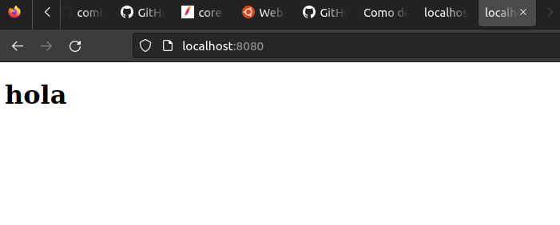
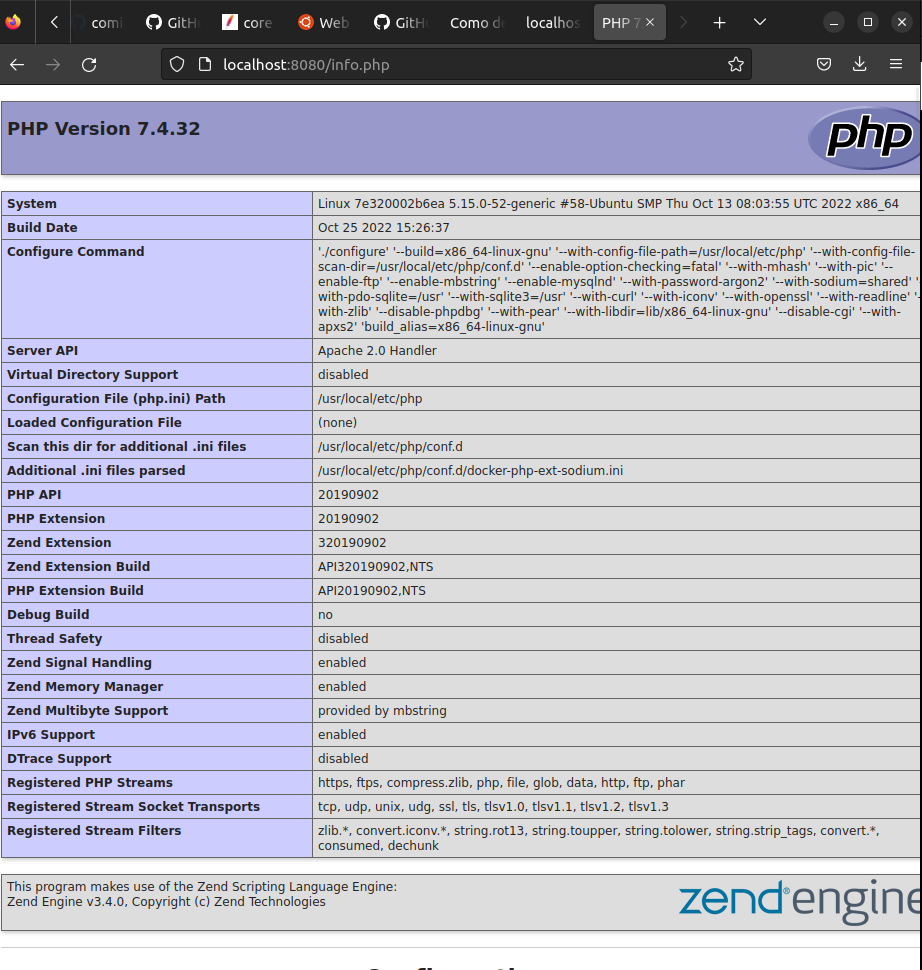

# proyectoApache

 **Para la realización de este ejercicio empezaremos por:**

## Buscar una imagen ya hecha de apache en php ##

  Buscamos la imagen de php, para la que elegimos php 7.4-apache, que será la que utilicemos para crear             nuestro contenedor. 

## Utiliza docker-compose para configurar el contenedor  ##

## Mapea el "DocumentRoot" del apache con una carpeta local ##

## Realiza un "hola mundo" en html y comprueba que funciona ##

  

## Utiliza la función de phpinfo() para testear que el módulo de php funciona ##

